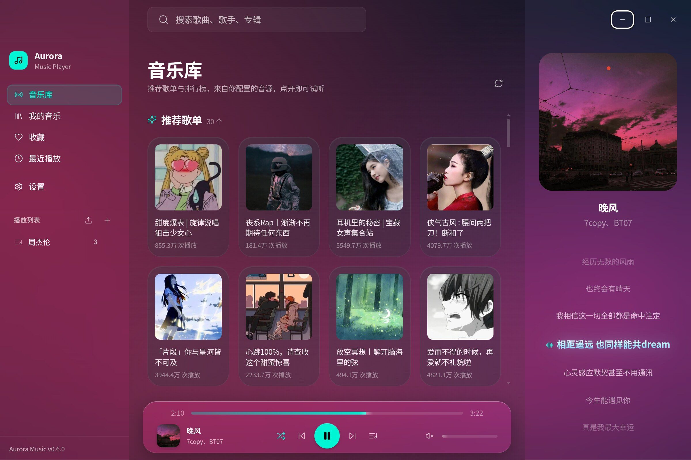
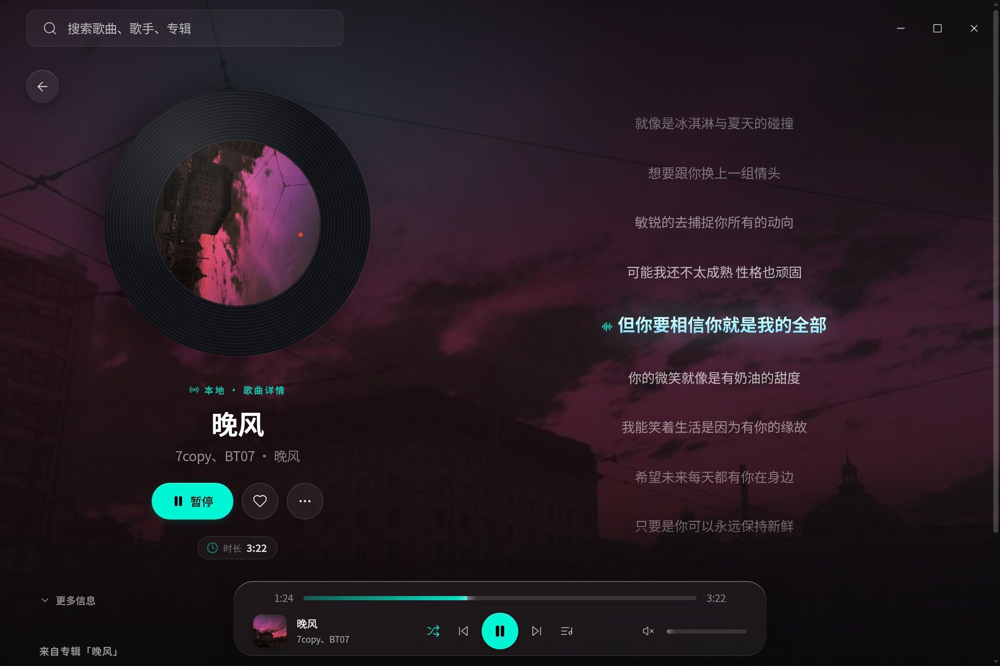
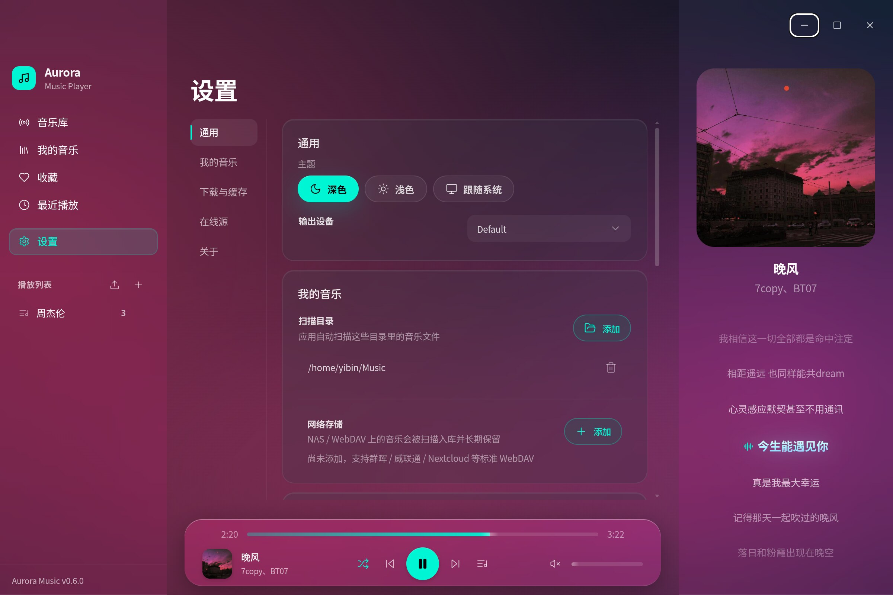
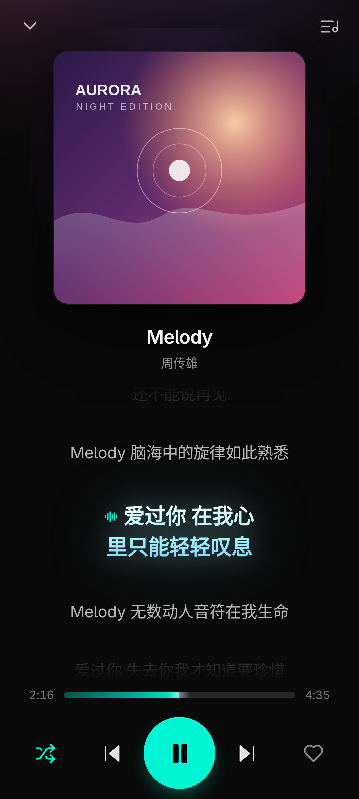

# Aurora Music

<p align="center"></p>

<p align="center">
  <strong>Aurora Music</strong> — a cross-platform music player for <strong>desktop (Linux / Windows / macOS) and Android</strong>.<br/>
  The desktop app is Electron + React + Vite; the mobile app is packaged with Capacitor and hands playback to a native engine, so one UI codebase stays consistent across platforms.<br/>
  
  &nbsp;·&nbsp; <a href="./README.md">中文说明</a>
</p>

---

## Screenshots

**Desktop** — online library / now playing / settings

<p align="center"></p>

<table align="center"><tr>
  <td></td>
  <td></td>
</tr></table>

**Android** — native playback engine with lock-screen and notification controls

<p align="center"></p>

---

## Features

| Capability | Desktop (Linux / Windows / macOS) | Android |
|---|---|---|
| Local playback | Folder scanning with progressive indexing, plus WebDAV media libraries | System folder import with storage permission flow |
| Background playback | Keeps playing in the tray after the window is closed | MediaSession foreground service; stable on the lock screen and after deep screen-off |
| Online search | Search / preview / download / cache (adjustable quota, one-click clear) | Same quota model; configurable download folder, native background download |
| In-app updates | Per-platform package recommendation (EXE / RPM / DEB / AppImage / DMG), one-click install | Hands off to the system installer |

The first screen is the **online library**: recommended playlists and charts served live by the music source you configure, played straight from the list without being added to your collection. **My Music** is your own scanned local / WebDAV collection — long-lived and playable offline. With no source configured, the online library shows a guided empty state while the local collection keeps working.

- **Lyrics** — LRC synchronized lyrics (including word-level timestamps), provided by your music source; no separate lyrics source needed
- **Playlist import** — share links (resolved through your source) or plain text (handled locally, zero network requests), matched against your local library
- **Appearance** — Liquid Glass aesthetics, dynamic cover glow background, dark / light / follow-system themes
- **Languages** — Simplified Chinese and English, following the system by default and pin-able in Settings; the UI, Android notification controls, the desktop `.desktop` entry and deb metadata are all localized
- **Resilient update delivery** — update checks and installer downloads fall back from GitHub official to public mirrors: checks race the candidates concurrently, downloads follow the system proxy and switch source when one is clearly slower

> The interface ships in Simplified Chinese and English. It follows the system language by default and can be pinned to either one in Settings; the Android notification controls and permission prompts are localized along with it.

---

## Music sources

The app bundles **no** music sources: online search, lyric matching and playlist resolution all use HTTP endpoints you configure, or LX Music–style user source scripts (Settings → Online sources). **One source provides all three capabilities.**

Endpoint and response details, LX script platform fields, and the WebDAV library are documented in [docs/music-sources.md](./docs/music-sources.md) (Chinese).

---

## Getting started

```bash
git clone https://github.com/yib0601/aurora-music.git && cd aurora-music
pnpm install
pnpm rebuild          # rebuild the better-sqlite3 native module
pnpm dev              # desktop app (Electron + Vite HMR)
pnpm dev:app          # web UI only
```

The repository is a pnpm monorepo: `packages/{app, desktop, mobile, shared}`. Requirements: Node.js ≥ 20, pnpm ≥ 9.15; Android builds additionally need JDK 17+ and the Android SDK.

Tests, the Android build, platform notes and packaging are documented in [docs/development.md](./docs/development.md) (Chinese).

---

## License

[PolyForm Noncommercial License 1.0.0](./LICENSE) — commercial use is not permitted. Personal use, study, modification and non-commercial distribution are unrestricted; commercial use requires permission from the author. Versions up to v0.4.2 remain MIT licensed.
