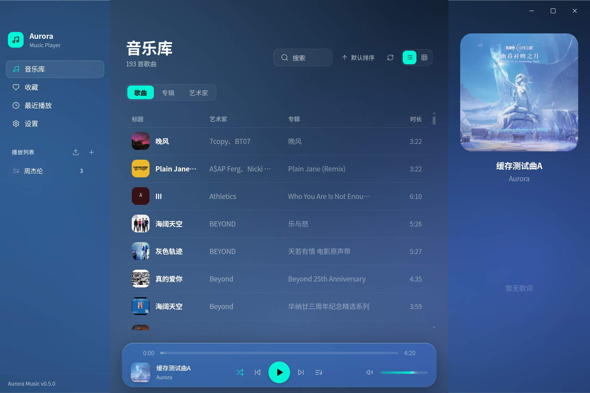
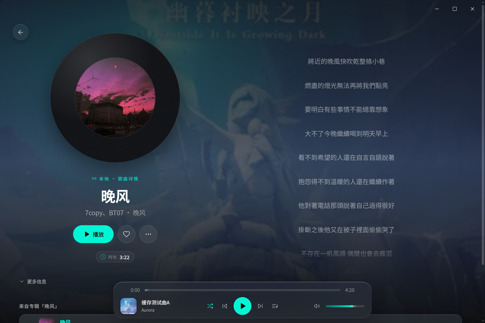
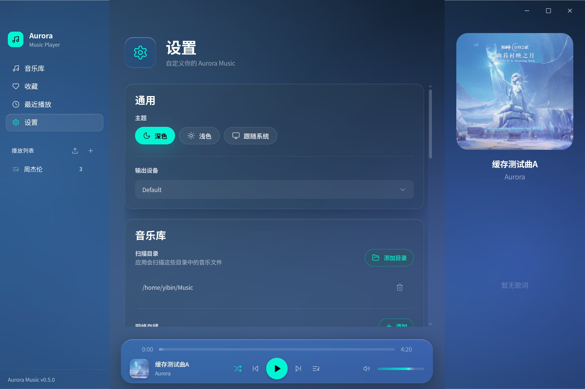
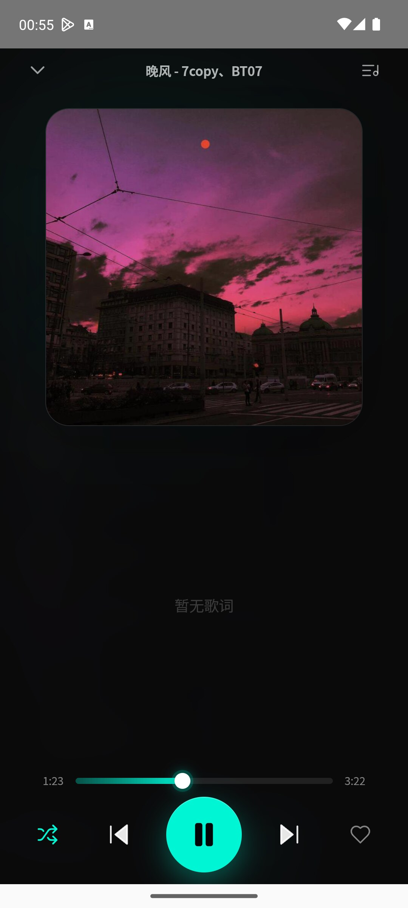

# Aurora Music

<p align="center">
  
</p>

<p align="center">
  <strong>Aurora Music</strong> — 跨平台音乐播放器，覆盖 <strong>桌面（Linux / Windows / macOS）与 Android</strong>。<br/>
  桌面端基于 Electron + React + Vite，移动端由 Capacitor 打包、原生播放引擎接管播放，一套 UI 代码多端一致。
</p>

<p align="center">
  
</p>

---

## 截图

**桌面端** — 音乐库 / 播放详情 / 设置（在线音源）

<p align="center">
  
</p>

<table align="center"><tr>
  <td></td>
  <td></td>
</tr></table>

**Android** — 原生播放引擎，锁屏与通知栏媒体控制

<p align="center">
  
</p>

---

## 特性

跨平台能力对照：

| 能力 | 桌面（Linux / Windows / macOS） | Android |
|---|---|---|
| 本地播放 | 扫描文件夹、渐进式入库 | 系统文件夹导入、存储权限引导 |
| 后台播放 | 关闭窗口最小化到托盘继续播放 | MediaSession 前台服务，锁屏/后台稳定播放、深度灭屏恢复进度 |
| 在线搜索 | 搜索 / 试听 / 下载 / 播放缓存（容量可调、一键清空） | 搜索 / 试听 / 下载，下载目录可配置 |
| 应用内更新 | 按平台推荐安装包（EXE / RPM / DEB / AppImage / DMG），下载可收起、一键安装 | 原生后台线程下载（不依赖 DownloadManager），调起系统安装器 |

各平台通用：

- **音乐库** — 收藏、最近播放、播放次数、快速搜索、队列管理与顺序/随机/单曲循环
- **歌词** — LRC 同步歌词（含逐字时间戳），多个在线歌词源自动匹配
- **歌单导入** — 分享链接（经音源解析）或纯文本（本地处理、零网络请求），自动匹配本地曲库
- **WebDAV 远端媒体库** — 挂载群晖 / 威联通 / Nextcloud / rclone，扫描入库长期保留（桌面端）
- **外观** — Liquid Glass 毛玻璃美学、动态封面柔光背景、深色 / 浅色 / 跟随系统主题
- **更新下载多源降级** — GitHub 官方直连失败时自动切换公共加速前缀

---

## 歌源协议

应用不内置任何音源 / 歌词源，在线搜索、歌词匹配与歌单解析均依赖用户自行配置的 HTTP 接口（设置 → 在线搜索）。

### 音源

只填一条链接，形态由链接自身判定：

- **服务地址**（推荐）：端点自动生成——搜索 `{服务地址}/aurora?query={query}&quality={quality}&key={密钥}`，歌单 `{服务地址}/aurora/playlist?url={url}&key={密钥}`。应用优先读服务端的端点自描述（`GET {服务地址}/` 响应里的 `endpoints` 字段），读不到按默认约定组装；「测试连接」会校验连通性与密钥。密钥直接写在链接里即可（如 `https://host?key=xxx`）。
- **接口模板**：链接含 `{query}` 占位符时原样使用，适配第三方接口。响应为 JSON（数组或 `{results:[]}` / `{data:[]}` / `{songs:[]}` / `{list:[]}` 包裹）；每项 `audioUrl` 必填，`title` / `artist` / `album` / `duration`（秒）/ `coverUrl` 可选；多音质用 `qualityUrls` 或 `url_128` / `url_320` / `url_flac`。
- **歌单解析接口**（可选）：含 `{url}` 占位符才参与歌单导入；每项 `title` / `artist`（兼容 `name` / `songName` / `singer`），可选 `name` 提供歌单标题。
- 请求头为可选 JSON 对象，用于鉴权或特定 Referer / User-Agent。

> v0.4.x 的独立「歌单解析源」配置在升级后自动迁移为新形态。

### 歌词源

占位符 `{track}`（歌曲名）/ `{artist}` / `{album}` / `{duration}`（秒）；歌词字段兼容 `syncedLyrics` / `lrc` / `plainLyrics`。

### WebDAV 媒体库（桌面端）

与在线音源不同，这是入库的持久曲库来源：配置服务器地址、账号与口令，测试连接后扫描入库。口令仅存本机；移除来源会连同其曲目一起从音乐库删除（远端文件不受影响）。

---

## 快速开始

```bash
git clone https://github.com/yib0601/aurora-music.git && cd aurora-music
pnpm install
pnpm rebuild          # 重建 better-sqlite3 原生模块
pnpm dev              # 桌面端（Electron + Vite 热重载）
pnpm dev:app          # 仅 Web UI
```

代码为 pnpm monorepo：`packages/{app, desktop, mobile, shared}`。

环境要求：Node.js ≥ 20、pnpm ≥ 9.15；Android 构建另需 JDK 17+ 与 Android SDK。

Android 构建：

```bash
pnpm build:app
cd packages/mobile && npx cap sync android
cd android && ./gradlew assembleDebug   # 产物在 app/build/outputs/apk/
```

> Web 层改动需先 `build:app` 再 `cap sync`，否则打包旧资源；原生代码改动只需重跑 gradlew。

平台说明：

- **Linux** 仅支持 Wayland；AMD GPU 渲染黑屏已内置 `--disable-gpu` 解决。
- **macOS** dmg 按芯片分 `-arm64` / `-x64`；ad-hoc 签名、未经公证，首启被 Gatekeeper 拦截时执行 `xattr -cr /Applications/Aurora-Music.app`。
- 切换 Node / Electron 版本后需重新 `pnpm rebuild`。

---

## 构建分发

- **桌面**：`pnpm build:desktop`，产物在 `packages/desktop/release/`（Linux AppImage / deb、Windows NSIS）；RPM 用自带的 `./build-rpm.sh`（绕开 electron-builder 内置 fpm 在 Ubuntu 上的 rpmdb 问题）。
- **发布**：推送 `v*` tag 触发 GitHub Actions 自动构建全平台产物（Windows / Linux / macOS 双架构 / Android）并发布 Release，发布前自动校验 APK 签名与 macOS 产物。
- **签名密钥**：APK 统一由仓库内固定的 `packages/mobile/android/app/aurora-music.keystore` 签名（SHA-256 `eb4e48a95587ed954789b81b20fc23689cc702e602ebac08050d308eabdb435b`），CI 每次校验指纹。该文件绝不可更换，否则存量用户无法覆盖升级；v0.1.4 及更早版本使用随机调试签名，升级到新版需卸载重装一次。

---

## 许可

[PolyForm Noncommercial License 1.0.0](./LICENSE)：允许个人使用、学习、二次修改与非商业分发；任何商业目的的使用需联系作者授权。v0.4.2 及更早的已发布版本仍按 MIT 授权。
