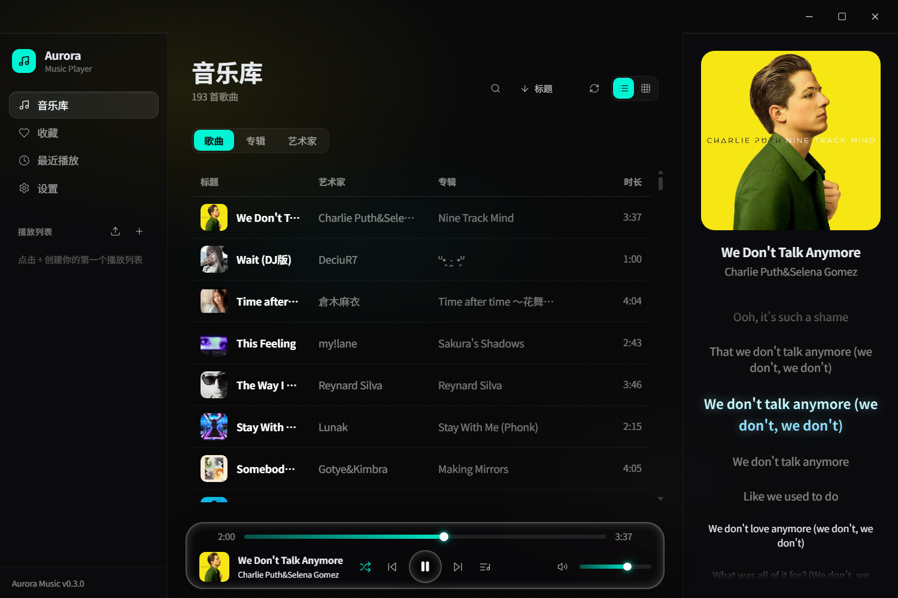
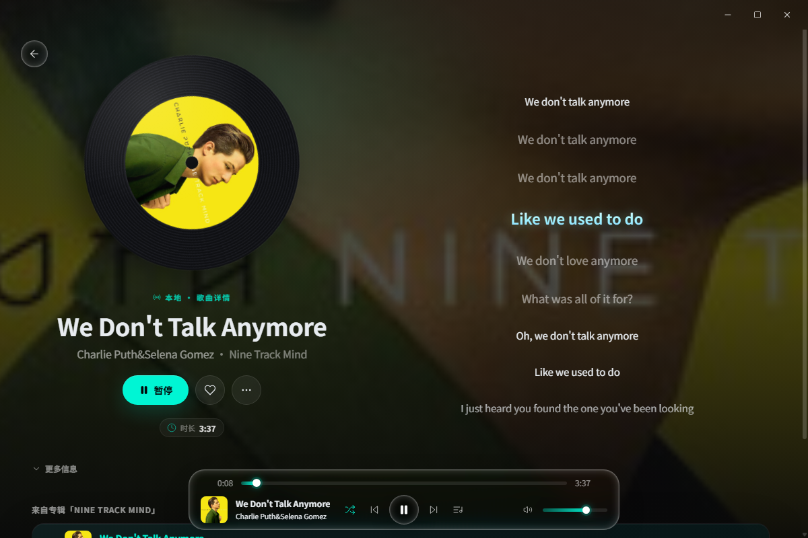
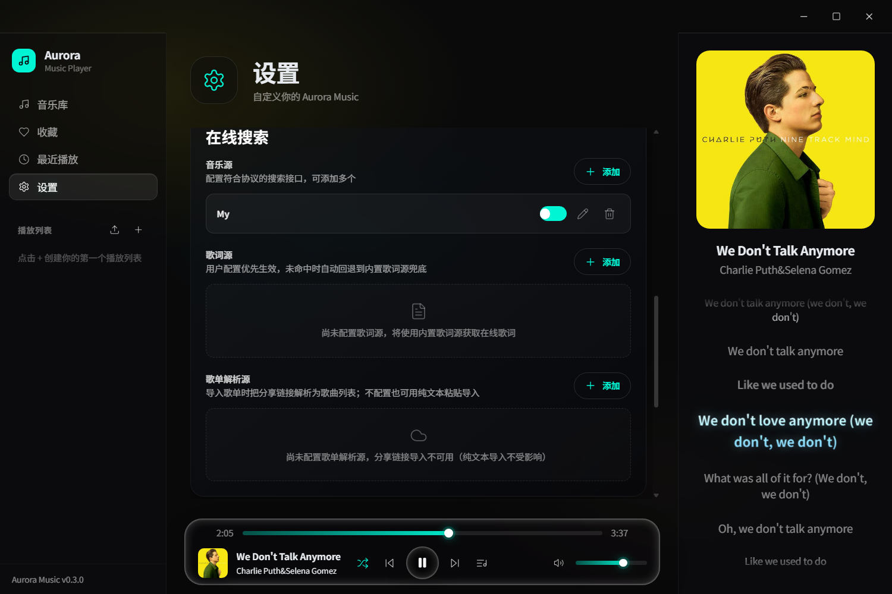

# Aurora Music ⛅

<p align="center">
  
</p>

<p align="center">
  <strong>Aurora Music</strong> — 一款跨平台的音乐播放器，基于 Electron + React + Vite 构建，移动端通过 Capacitor 打包为 Android 应用。
</p>

<p align="center">
  
</p>

---

## 截图

**音乐库** — 本地歌曲列表、专辑封面与右侧 Now Playing 面板



**播放详情** — 黑胶唱片视觉、动态歌词与沉浸背景



**设置 · 在线搜索** — 自定义音乐源 / 歌词源 / 歌单解析源（协议见[歌源协议规范](#歌源协议规范)）



---

## 特性

### 播放与音乐库

- 🎵 **本地音乐播放** — 扫描本地文件夹，渐进式入库（边扫描边显示，无需等待全部解析完成）
- 🗄️ **远端媒体库（WebDAV）** — 挂载群晖 / 威联通 / Nextcloud / rclone 等标准 WebDAV 服务，浏览并播放远端曲目，扫描入库后长期保留（桌面端）
- 📥 **歌单导入** — 粘贴其他平台的歌单分享链接（经自配解析源解析）或纯文本（本地处理、零网络请求），自动匹配本地曲库，跨来源防串味
- 🔀 **智能播放控制** — 顺序/随机/单曲循环，播放队列管理与去重
- 📜 **歌词滚动** — 同步显示歌词（LRC 格式，含逐字尖括号时间戳），支持配置多个在线歌词源自动匹配
- 📊 **音频可视化** — 内置频谱可视化器，动态主题色提取
- 🔍 **快速搜索** — 按标题、艺术家、专辑搜索，附带历史搜索记录
- ❤️ **收藏与最近播放** — 标记喜爱的歌曲，追踪播放历史与播放次数
- 🌐 **在线搜索与下载** — 按歌源协议配置音源后，可在线搜索、试听并下载歌曲到本地音乐库（启动时可自动恢复在线歌曲播放）

### 外观

- 🎨 **毛玻璃美学** — 沉浸式 Liquid Glass UI，动态封面柔光背景
- 🌗 **主题系统** — 深色 / 浅色 / 跟随系统三档切换，状态栏颜色自动同步

### 桌面端

- 🪟 **无边框窗口** — 自定义标题栏与边缘缩放，原生级窗口体验
- 📍 **系统托盘** — 关闭窗口最小化到托盘继续播放
- 🖥️ **跨平台** — Linux / Windows / macOS

### 移动端（Android）

- 📱 **原生播放引擎** — MediaSession 前台服务，锁屏/后台稳定播放不中断
- 🔒 **锁屏控件** — 系统锁屏界面与通知栏媒体控制，深度灭屏后自动恢复播放进度
- 📂 **文件夹导入** — 系统文件夹选择器导入音乐，未授权存储权限时自动引导
- ⬅️ **返回键分层处理** — 先关浮层再退路由，主屏二次确认退出
- 🎛️ **移动端适配 UI** — 汉堡导航、全屏 Now Playing 页面

### 其他

- ⬆️ **应用内更新** — 启动时检查新版本并展示更新横幅，按发行版推荐匹配的安装包（Fedora/RHEL 系给 RPM、Debian/Ubuntu 系给 DEB、便携运行给 AppImage），支持应用内下载并一键安装（进度对话框，下载可收起后台继续）

---

## 歌源协议规范

应用不内置任何音乐源 / 歌词源 / 歌单抓取器，在线搜索、歌词匹配与歌单分享链接解析均依赖用户自行配置的 HTTP 接口（设置 → 在线搜索）。每类源的配置项为「接口地址 + 可选请求头」，协议如下：

### 音乐源

- 接口地址需包含 `{query}` 占位符（搜索时替换为 URL 编码后的关键词）；可选 `{quality}` 占位符（替换为下载音质设置：128 / 320 / flac）。
- 响应为 JSON，支持数组或 `{results:[]}` / `{data:[]}` / `{songs:[]}` / `{list:[]}` 包裹。
- 每项字段：`audioUrl`（必填）、`title` / `artist` / `album` / `duration`（秒）/ `coverUrl`。
- 可选多音质地址 `qualityUrls: { "128": url, "320": url, "flac": url }` 或扁平字段 `url_128` / `url_320` / `url_flac`，下载时按音质设置挑选。

### 歌词源

- 接口地址占位符 `{track}`（歌曲名）/ `{artist}` / `{album}` / `{duration}`（秒）。
- 响应支持单对象或数组，歌词字段兼容 `syncedLyrics` / `lrc` / `plainLyrics`。

### 歌单解析源

- 接口地址需包含 `{url}` 占位符（替换为歌单分享链接）。
- 响应为 JSON，支持数组或 `{results:[]}` / `{data:[]}` / `{songs:[]}` / `{list:[]}` 包裹；可选 `name` 字段提供歌单标题。
- 每项字段：`title` / `artist`（兼容 `name` / `songName` / `singer`）。

### 请求头

请求头为可选 JSON 对象，用于需要鉴权或特定 Referer / User-Agent 的接口。

### 网络存储（WebDAV）来源

与上述三类「歌源」不同，这是会入库的持久曲库来源（设置 → 媒体库，仅桌面端）：

- 支持标准 WebDAV 服务：群晖、威联通、Nextcloud、`rclone serve webdav` 等。
- 配置项：服务器地址、用户名、口令与自定义请求头；添加后可先「测试连接」，再扫描入库。
- 口令仅保存在本机配置中，不会写入曲库、也不会出现在播放地址里（远端请求由主进程代理）。
- 移除来源时会连同该来源的曲目一起从音乐库删除（远端文件不受影响）。

---

## 快速开始

```bash
# 克隆
git clone https://github.com/yib0601/aurora-music.git
cd aurora-music

# 安装依赖（推荐 pnpm）
pnpm install

# 重建原生模块（better-sqlite3）
pnpm rebuild

# 运行桌面应用（开发模式）
pnpm dev

# 或仅运行 Web UI
pnpm dev:app
```

### 环境要求

- **Node.js** >= 20.0.0
- **pnpm** >= 9.15.0（npm 可用但不推荐）
- Android 构建额外需要：JDK 17+、Android SDK（AGP 9.x）

---

## 项目结构

```
aurora-music/
├── packages/
│   ├── app/              # React Web UI（Vite + TailwindCSS + Zustand）
│   │   ├── src/
│   │   │   ├── components/   # UI 组件
│   │   │   │   ├── layout/      # Sidebar / TitleBar / ResizeHandle
│   │   │   │   ├── player/      # PlayerBar / QueueView
│   │   │   │   ├── lyrics/      # 歌词滚动
│   │   │   │   ├── visualizer/  # 音频可视化
│   │   │   │   ├── mobile/      # 移动端组件（MobileFolderPicker 等）
│   │   │   │   └── ui/          # Radix UI 基础组件
│   │   │   ├── pages/        # 页面（Library, Search, Settings...）
│   │   │   ├── stores/       # 状态管理（Zustand + useShallow）
│   │   │   ├── hooks/        # useAudioVisualizer / useThemeColor
│   │   │   ├── lib/          # colorExtractor / utils
│   │   │   └── services/     # audio / lyrics / platform / update
│   │   └── dist/             # 构建输出
│   ├── desktop/          # Electron 桌面应用
│   │   ├── src/
│   │   │   ├── ipc/         # IPC 处理器（扫描、数据库、在线搜索、远端库、窗口控制）
│   │   │   ├── main.ts      # Electron 主进程（无边框窗口 + 托盘）
│   │   │   ├── preload.ts   # 上下文隔离 API 桥
│   │   │   └── types.ts
│   │   ├── resources/       # 图标 / .desktop 文件
│   │   └── dist-electron/   # 编译输出
│   ├── mobile/           # Capacitor 移动端（Android）
│   │   ├── android/         # Android 原生工程
│   │   │   └── app/src/main/java/com/aurora/music/
│   │   │       ├── MainActivity.java
│   │   │       ├── MediaPlaybackService.kt   # 前台服务 + 原生 MediaSession
│   │   │       ├── MediaSessionPlugin.kt     # WebView ↔ 原生播放桥
│   │   │       └── PermissionPlugin.kt       # 存储权限桥
│   │   └── capacitor.config.ts
│   └── shared/           # @aurora/shared：歌源协议规范与执行器、WebDAV 客户端、曲目身份识别
├── scripts/              # 打包辅助脚本（postinst / postremove / build / APK 签名校验）
├── build-rpm.sh          # RPM 打包脚本（基于 fpm）
├── build-deb.sh          # DEB 打包脚本
├── .github/workflows/    # CI：tag 触发 Release（Windows/Linux/Android）
├── pnpm-workspace.yaml
├── tsconfig.base.json
└── package.json
```

---

## 技术栈

| 层 | 技术 |
|------|--------|
| 前端框架 | React 18 + TypeScript |
| 构建工具 | Vite 5 |
| 样式 | TailwindCSS 3 + 毛玻璃效果 |
| 状态管理 | Zustand 5（`useShallow` 订阅优化）|
| 路由 | React Router 6（HashRouter 适配桌面端）|
| UI 基础组件 | Radix UI + CVA + tailwindcss-animate |
| 动画 | Framer Motion |
| 音频引擎 | Howler.js + Web Audio API |
| 桌面壳 | Electron 43（无边框 + 自定义缩放 + 托盘）|
| 移动端 | Capacitor 6（Android 原生播放引擎 + MediaSession）|
| 本地数据库 | better-sqlite3 / @capacitor-community/sqlite + music-metadata |
| 歌源协议 | @aurora/shared（音源/歌词源协议规范与执行器、WebDAV 客户端）|
| 包管理 | pnpm workspace monorepo |

---

## 开发

```bash
# Web UI 单独开发（浏览器）
pnpm dev:app

# Electron 桌面开发（热重载）
pnpm dev:desktop

# 构建
pnpm build

# 类型检查
pnpm --filter @aurora/desktop typecheck
```

### Android 开发

```bash
# 1. 构建 Web 资源
pnpm build:app

# 2. 同步到 Android 工程（在 packages/mobile 目录执行）
cd packages/mobile && npx cap sync android

# 3. 编译 APK（debug）
cd android && ./gradlew assembleDebug

# 产物位于 packages/mobile/android/app/build/outputs/apk/debug/
```

> 原生代码改动（MediaPlaybackService 等）只需重新执行 gradlew；Web 层改动需先 `build:app` 再 `cap sync`，否则会打包旧资源。

### 平台说明

- **Linux / Wayland**：仅支持 Wayland，请勿添加 `--ozone-platform=x11`（会导致崩溃）。AMD GPU 如遇渲染黑屏，应用已内置 `--disable-gpu` 启动参数解决。
- 原生模块（better-sqlite3）切换 Node/Electron 版本后需运行 `pnpm rebuild`。

---

## CI / CD

仓库有两个 GitHub Actions 工作流，职责严格分开：

| 工作流 | 触发条件 | 做什么 |
| --- | --- | --- |
| `ci.yml` | push 到任意分支、PR 到 `main`、手动 dispatch | 只校验，不发布 |
| `release.yml` | 推送 `v*` tag、手动 dispatch | 构建全平台产物并创建 GitHub Release |

`ci.yml` 的两个任务：

- **Typecheck & Build (app/desktop)** — `shared` 构建 + 三端类型检查（`shared` / `app` / `desktop` electron），再跑 `vite build` 与 electron 主进程编译，确认「类型对得上、包能构建出来」。
- **Verify Android build & signing** — `cap sync` 后编译 debug APK，并用 `scripts/verify-apk-signature.sh` 校验签名指纹与版本号。签名密钥被换掉、版本号没跟着涨这类问题，历史上多次出现「CI 全绿、用户装不上」，现在会在 PR 阶段直接失败。

tag 推送由 `ci.yml` 的 `tags-ignore` 让路给 `release.yml`，同一提交不会重复跑。

---

## 构建分发

### Linux（RPM）

项目自带 `build-rpm.sh` 打包脚本（基于 [fpm](https://github.com/jordansissel/fpm)），绕开 electron-builder 内置 fpm 在 Ubuntu 上的 rpmdb 写入问题。

```bash
# 1. 构建桌面应用（解包目录）
pnpm --filter @aurora/desktop run build:dir

# 2. 打包 RPM
./build-rpm.sh

# 3. 安装
sudo rpm -Uvh --nodeps packages/desktop/release/Aurora-Music-<version>-1.x86_64.rpm

# 启动
Aurora-Music      # 终端
# 或在应用菜单中查找 "Aurora Music"
```

安装后入口：`/opt/Aurora-Music/`，桌面项：`/usr/share/applications/Aurora-Music.desktop`。

### Linux（其他格式）/ Windows

```bash
# electron-builder 默认产物
pnpm build:desktop

# 产物位于 packages/desktop/release/
# - Linux: AppImage / deb（electron-builder）
# - Windows: NSIS / portable
```

> ⚠️ Ubuntu 上 electron-builder 内置的 RPM 打包可能因 rpmdb.sqlite 写权限失败，建议使用上述 `build-rpm.sh` 脚本。

### Android（APK）

```bash
# 完整流程（也可参考上节「Android 开发」）
pnpm build:app
cd packages/mobile && npx cap sync android
cd android && ./gradlew assembleRelease   # 或 assembleDebug

# 校验产物签名（发布前必做，CI 已自动执行）
cd ../.. && bash scripts/verify-apk-signature.sh android/app/build/outputs/apk/debug/app-debug.apk
```

> 推送 `v*` tag 会触发 GitHub Actions 自动构建全平台产物并发布 Release。
> CI 会先用 `scripts/verify-apk-signature.sh` 校验 APK 签名与版本号，不符即中止发布。

#### 发布签名密钥（重要）

所有版本的 APK 统一由仓库内的 `packages/mobile/android/app/aurora-music.keystore` 签名，
证书 SHA-256 指纹固定为：

```
eb4e48a95587ed954789b81b20fc23689cc702e602ebac08050d308eabdb435b
```

> ⚠️ **该密钥文件必须永久保持不变。** 一旦缺失或被重新生成（哪怕别名、密码相同），
> 所有已安装用户都会因签名不一致而无法覆盖升级，只能卸载重装。
> `app/build.gradle` 在密钥缺失时会直接让构建失败，CI 也会校验指纹，以此杜绝静默换钥。

版本号由发布流程注入：`versionCode = major*10000 + minor*100 + patch`（如 `0.1.8` → `108`），
`versionName` 取自 tag。本地不带参数构建时回退为 `1` / `1.0`。

#### 从 v0.1.4 及更早版本升级

v0.1.4 及更早的 APK 由 CI 每次构建随机生成的调试密钥签名（**每个版本都不同**），因此无法覆盖安装。
v0.1.5 起已改为固定发布密钥。从 v0.1.4 或更早版本升级时，需**先卸载旧版本再安装**（仅需一次）：

```bash
adb uninstall com.aurora.music   # 或在手机上长按图标 → 卸载
```

卸载会清除应用数据（音乐库索引、收藏、播放记录；本地音乐文件不受影响），
重装后再点「添加目录」导入一次即可。

---

## 许可

本项目采用 [PolyForm Noncommercial License 1.0.0](./LICENSE)（**非商用协议**）。

**中文摘要**（非法律意见，以协议原文为准）：

- ✅ 允许：个人使用、学习、研究、二次修改与分发（须附带协议条款与版权声明）
- ❌ 禁止：任何以商业为目的的使用、分发或衍生（包括但不限于商业运营、打包进商业产品、提供付费服务）
- 公益、教育、公共研究等非营利组织的使用不受限制
- 如需商业授权，请联系仓库作者

> 注意：v0.4.2 及更早版本发布时采用 MIT 协议，那些已发布版本的授权不受本次变更影响；本协议自其后的版本起生效。
