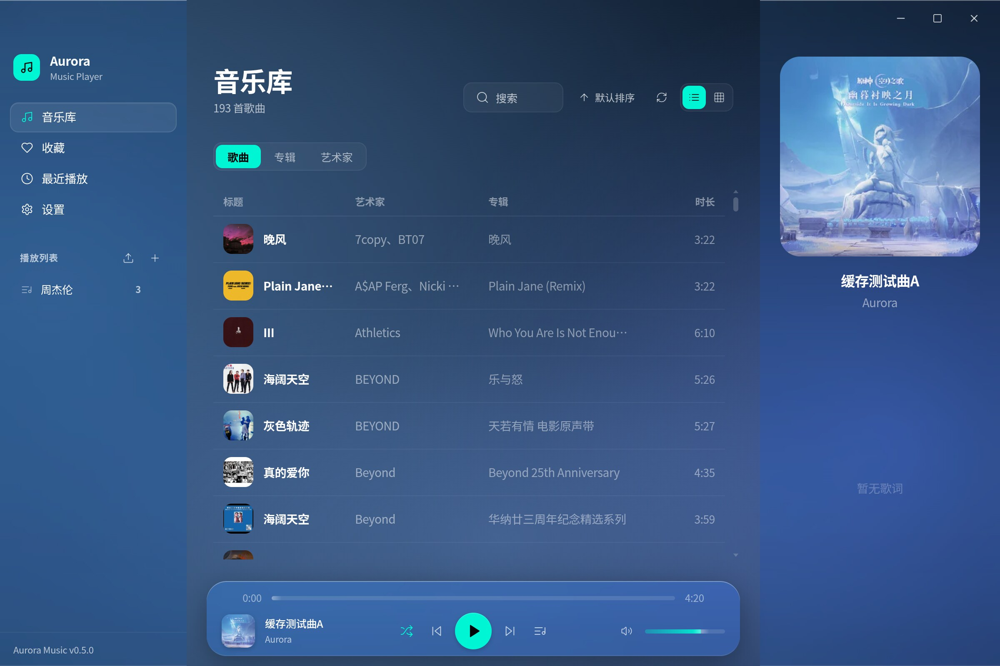

# Aurora Music

<p align="center">
  
</p>

<p align="center">
  <strong>Aurora Music</strong> — 跨平台音乐播放器，覆盖 <strong>桌面（Linux / Windows / macOS）与 Android</strong>。<br/>
  桌面端基于 Electron + React + Vite，移动端由 Capacitor 打包、原生播放引擎接管播放，一套 UI 代码多端一致。
</p>

<p align="center">
  
</p>

---

## 截图

**桌面端** — 我的音乐 / 播放详情 / 设置（在线音源）

<p align="center">
  
</p>

<table align="center"><tr>
  <td></td>
  <td></td>
</tr></table>

**Android** — 原生播放引擎，锁屏与通知栏媒体控制

<p align="center">
  
</p>

---

## 特性

跨平台能力对照：

| 能力 | 桌面（Linux / Windows / macOS） | Android |
|---|---|---|
| 本地播放 | 扫描文件夹、渐进式入库 | 系统文件夹导入、存储权限引导 |
| 后台播放 | 关闭窗口最小化到托盘继续播放 | MediaSession 前台服务，锁屏/后台稳定播放、深度灭屏恢复进度 |
| 在线搜索 | 搜索 / 试听 / 下载 / 缓存（容量可调、一键清空） | 搜索 / 试听 / 下载 / 缓存（与桌面端同一份配额口径），下载目录可配置 |
| 应用内更新 | 按平台推荐安装包（EXE / RPM / DEB / AppImage / DMG），下载可收起、一键安装 | 原生后台线程下载（不依赖 DownloadManager），调起系统安装器 |

各平台通用：

首屏是**音乐库**（在线推荐歌单与排行榜，由你配置的音源服务提供，应用不内置任何平台抓取器）；**我的音乐**是你自己扫描入库的本地/WebDAV 资产，长期有效、离线可播。未配音源时音乐库展示引导空态，本地曲库不受影响。

- **音乐库** — 推荐歌单与歌曲排行榜，点开即试听，即点即播、不入库
- **我的音乐** — 收藏、最近播放、播放次数、快速搜索、队列管理与顺序/随机/单曲循环
- **歌词** — LRC 同步歌词（含逐字时间戳），多个在线歌词源自动匹配
- **歌单导入** — 分享链接（经音源解析）或纯文本（本地处理、零网络请求），自动匹配本地曲库
- **WebDAV 远端媒体库** — 挂载群晖 / 威联通 / Nextcloud / rclone，扫描入库长期保留（桌面端）
- **外观** — Liquid Glass 毛玻璃美学、动态封面柔光背景、深色 / 浅色 / 跟随系统主题
- **更新多源兜底** — 检查更新与安装包下载按「GitHub 官方 → 公共加速前缀」依次降级：检查更新用并发竞速（直连与加速站同时发起，谁先应答用谁），下载则在源明显过慢时自动换源；加速前缀只透传 GitHub 原始链接，实测 gh-proxy.com 3.76 MB/s、ghfast.top 3.01 MB/s
- **桌面端更新下载走系统代理** — 下载安装包时跟随系统代理设置，并在源明显过慢时主动换源续传；公共加速前缀仅作断网兜底

---

## 歌源协议

应用不内置任何音源 / 歌词源，在线搜索、歌词匹配与歌单解析均依赖用户自行配置的 HTTP 接口，或按洛雪格式自备的音源脚本（设置 → 在线源）。

### 音源

音源分两种形态：按本应用协议实现的 **aurora 音源服务**（以下几节），以及洛雪音乐的用户自定义 **脚本音源**（见「洛雪音源脚本」）。aurora 音源只填一条链接，形态由链接自身判定：

- **服务地址**（推荐）：端点自动生成——搜索 `{服务地址}/aurora?query={query}&quality={quality}&key={密钥}`，歌单 `{服务地址}/aurora/playlist?url={url}&key={密钥}`。应用优先读服务端的端点自描述（`GET {服务地址}/` 响应里的 `endpoints` 字段），读不到按默认约定组装；「测试连接」会校验连通性与密钥。密钥直接写在链接里即可（如 `https://host?key=xxx`）。
- **接口模板**：链接含 `{query}` 占位符时原样使用，适配第三方接口。响应为 JSON（数组或 `{results:[]}` / `{data:[]}` / `{songs:[]}` / `{list:[]}` 包裹）；每项 `audioUrl` 必填，`title` / `artist` / `album` / `duration`（秒）/ `coverUrl` 可选；多音质用 `qualityUrls` 或 `url_128` / `url_320` / `url_flac`。
- **歌单解析接口**（可选）：含 `{url}` 占位符才参与歌单导入；每项 `title` / `artist`（兼容 `name` / `songName` / `singer`），可选 `name` 提供歌单标题。
- 请求头为可选 JSON 对象，用于鉴权或特定 Referer / User-Agent。

> v0.4.x 的独立「歌单解析源」配置在升级后自动迁移为新形态。

### 洛雪音源脚本

支持直接使用[洛雪音乐](https://github.com/lyswhut/lx-music-desktop)（lx-music-desktop / lx-music-mobile）的用户自定义音源脚本。在设置页「音源」列表里添加一条脚本链接即可，链接指向脚本源码（GitHub Raw、jsDelivr 或自建托管都行），脚本源码不落库。

脚本形态与 aurora 音源的区别在于能力边界：

- 洛雪脚本绝大多数**只实现 `musicUrl`**（按曲目定位信息取音频直链），没有可供批量检索的公共搜索接口。因此搜索走本应用自己的搜索音源：先搜到曲目元信息，再按曲目的平台标识（`songmid` / `hash` 等）交给脚本取址。
- 少数脚本自带 `search` / `musicSearch` 能力（如幻音咪咕、全豆要汽水），这类脚本可直接参与搜索，搜索结果本身就是脚本自己的字段，取址时原样回喂。
- 咪咕（`mg`）是唯一不需要 id 的平台：脚本按「歌名 + 歌手」搜索取址，因此该平台的曲目定位信息是歌名与歌手名。

取址用到的平台字段（脚本生态里同一平台字段名不统一，应用会把同一个值写进全部候选名，实测确认）：

- 酷我 `kw`、酷狗 `kg`：`hash` | `songmid`（两者同源，都写最稳）
- QQ `tx`：`songmid`
- 网易 `wy`：`songmid` | `id`
- 咪咕 `mg`：歌名 + 歌手（无需 id）
- `git` / `local`：`id`

取址缺必要字段时直接给出可读原因并放弃该曲目，不会猜一个 id 硬发请求。

脚本在客户端沙箱内执行：宿主把 `globalThis` / `window` / `self` 换成构造出的伪全局，把 `document` / `navigator` / `location` / `localStorage` 与 Node 标识（`process` / `require` / `module` / `exports` / `global`）一律置为 `undefined`，并静默 `console`（默认丢弃脚本日志）；脚本拿不到宿主配置、数据库与文件系统接口。遮蔽 Node 标识这一步是必需的：实测有脚本探测到 `process` 就改走 Node 分支并同步挂死。脚本内的网络请求按协议一律经宿主的 `lx.request` 转发（宿主负责 UA、超时与请求头），这也是脚本能跨端复用的原因。

脚本源码按链接拉取、由平台侧缓存，同一份脚本在宿主里只加载（boot）一次；离线或链接不可达时该脚本源不可用，报错落在该源自身、不影响其它音源。设置页的「测试」会拉脚本并列出脚本自报的各平台能力（取址 / 搜索+取址、音质档位数）。

播放取址是**按需**的：脚本源搜到的条目只有元信息，双击播放（或下载）时才向脚本要直链，取到后回填到当前队列，不写库也不落盘——直链与脚本侧定位都会过期，重启后按元信息重新取即可。浏览器（Web）端没有原生 HTTP 与脚本执行能力，因此洛雪形态只在桌面端与手机端可选。

两种形态的差异只存在于**适配层内部**，应用其余部分（搜索聚合、试听、播放取址、下载、歌单导入、设置页测试）只使用同一套原生接口：

- 检索：`searchOnlineTracks` 对两种形态返回同一份 `OnlineTrackSearchResult`；按需取址的条目 `audioUrl` 为空串，另带一份**源私有的定位令牌** `trackRef`（应用只携带、不解释其内容）。
- 取址：`platform.resolveTrackAudio(track)` 按令牌向源索取地址并回填副本；没有令牌的条目直接回落「按歌名重新搜索」的老路径。
- 探测：`platform.probeSource(source)` 吸收全部形态差异（脚本形态：拉脚本 + 在宿主里执行一遍；服务形态：直连取端点自描述并验密钥），返回同一份能力结论（能力行 + 端点 + 结论文案），设置页不解释任何源私有结构。

新增一种源形态时，只需改这三处分派，界面与播放链路不动。

> 与 aurora 音源一样，应用不内置任何音源，也不做「推荐源站」；上面提到的脚本名仅用于说明协议字段差异。

### 歌词源

占位符 `{track}`（歌曲名）/ `{artist}` / `{album}` / `{duration}`（秒）；歌词字段兼容 `syncedLyrics` / `lrc` / `plainLyrics`。

### WebDAV 媒体库（桌面端）

与在线音源不同，这是入库的持久曲库来源：配置服务器地址、账号与口令，测试连接后扫描入库。口令仅存本机；移除来源会连同其曲目一起从曲库删除（远端文件不受影响）。

---

## 快速开始

```bash
git clone https://github.com/yib0601/aurora-music.git && cd aurora-music
pnpm install
pnpm rebuild          # 重建 better-sqlite3 原生模块
pnpm dev              # 桌面端（Electron + Vite 热重载）
pnpm dev:app          # 仅 Web UI
```

代码为 pnpm monorepo：`packages/{app, desktop, mobile, shared}`。

环境要求：Node.js ≥ 20、pnpm ≥ 9.15；Android 构建另需 JDK 17+ 与 Android SDK。

测试：

```bash
pnpm --filter @aurora/shared test   # 歌源协议与洛雪宿主的纯逻辑（含进程/超时对抗验证）
pnpm --filter @aurora/app test      # 渲染层与移动端缓存落盘
```

`@aurora/shared` 里有 4 条用例读**外部素材**（第三方洛雪脚本仓库 `pdone/lx-music-source`，脚本本身不入库）：本地已有克隆就直接用，没有就浅克隆到临时目录，两者都拿不到（出网受限）则显式 skip 并打印原因，不判失败。指定本地克隆用 `LX_SCRIPT_DIR=<目录>`，缓存位置用 `LX_SCRIPT_CACHE`。

Android 构建：

```bash
pnpm build:app
cd packages/mobile && npx cap sync android
cd android && ./gradlew assembleDebug   # 产物在 app/build/outputs/apk/
```

> Web 层改动需先 `build:app` 再 `cap sync`，否则打包旧资源；原生代码改动只需重跑 gradlew。

平台说明：

- **Linux** 走 X11 后端（Wayland 会话下由 Xwayland 承载，`.desktop` 的 Exec 已带 `--ozone-platform=x11`，主进程另有兜底重启）：无边框窗口的边缘缩放依赖客户端设置窗口位置，Wayland 原生后端下位置由合成器决定、设不了，拖上/左边缘会退化成「从底部/右侧缩放」。排障时可用 `--ozone-platform=wayland` 退回原生后端。
- **macOS** dmg 按芯片分 `-arm64` / `-x64`；ad-hoc 签名、未经公证，首启被 Gatekeeper 拦截时执行 `xattr -cr /Applications/Aurora-Music.app`。
- **移动端 UI 预览**：不必连真机。`pnpm dev:app` 后打开 `http://localhost:5173/?ui=mobile` 即强制走移动端布局（`?ui=desktop` 反向强制，只影响排版分支、不改变平台实现）；`http://localhost:5173/mobile-lab.html?ui=mobile&scene=np` 是播放界面验收台，用 mock 曲目渲染真实组件，`scene` 可切 `np` / `np-paused` / `np-empty` / `bar` / `bar-empty`，另支持 `theme=light` 与 `t=<秒>`。改移动端排版前先在这里对齐视觉，比反复装 APK 快得多。
  预览时请**同时覆盖手机视口与大屏视口**：外壳形态按屏幕尺寸分档（宽 ≥1024 或宽高都 ≥520 CSS 像素即大屏），两档的导航入口不同——大屏（竖屏车机 / 平板）是常驻侧栏，手机形态才是顶部汉堡 + 抽屉。只测手机宽度会漏掉车机场景：车机是像素密度极低的大屏（10 寸竖屏常见 1280×800 / 800×1280 像素），Capacitor 报 mobile 但尺寸远超手机，历史上正是这里出过「侧边导航栏整体消失」的问题，判据见 `packages/app/src/lib/shellMode.ts`。
- 切换 Node / Electron 版本后需重新 `pnpm rebuild`。

---

## 构建分发

- **桌面**：`pnpm build:desktop`，产物在 `packages/desktop/release/`（Linux AppImage / deb、Windows NSIS）；RPM 用自带的 `./build-rpm.sh`（绕开 electron-builder 内置 fpm 在 Ubuntu 上的 rpmdb 问题）。
- **发布**：推送 `v*` tag 触发 GitHub Actions 自动构建全平台产物（Windows / Linux / macOS 双架构 / Android）并发布 Release，发布前自动校验 APK 签名与 macOS 产物。
- **签名密钥**：APK 统一由仓库内固定的 `packages/mobile/android/app/aurora-music.keystore` 签名（SHA-256 `eb4e48a95587ed954789b81b20fc23689cc702e602ebac08050d308eabdb435b`），CI 每次校验指纹。该文件绝不可更换，否则存量用户无法覆盖升级；v0.1.4 及更早版本使用随机调试签名，升级到新版需卸载重装一次。

---

## 许可

[PolyForm Noncommercial License 1.0.0](./LICENSE)：禁止商业用途。个人使用、学习、二次修改与非商业分发不受限制，商业目的的使用需联系作者授权。v0.4.2 及更早的已发布版本仍按 MIT 授权。
